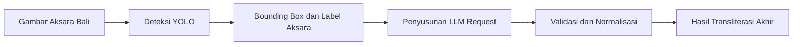

# AKSIFY — Hasil Pengujian Sistem

Repositori ini menyimpan artefak dan hasil pengujian **AKSIFY**, yaitu sistem pengenalan dan transliterasi Aksara Bali yang menggabungkan deteksi objek menggunakan YOLO dengan pemrosesan berbasis Large Language Model (LLM).

## Alur Pemrosesan



Secara umum, pengujian dilakukan melalui tahapan berikut:

1. Gambar Aksara Bali dimasukkan ke sistem.
2. Model YOLO mendeteksi aksara dan pengangge pada gambar.
3. Hasil deteksi disimpan sebagai data JSON dan divisualisasikan dalam bentuk bounding box.
4. Data deteksi disusun menjadi request untuk LLM.
5. Validator melakukan normalisasi dan menghasilkan transliterasi akhir.

## Daftar Pengujian

| Pengujian | Bounding Box | Deteksi YOLO | LLM Request | Output Validator | Kesimpulan |
|---|---|---|---|---|---|
| **Test 1** | [Lihat gambar](test1/BoundingBox.jpg) | [Lihat JSON](test1/DeteksiYOLO.json) | [Lihat gambar](test1/LLMRequest.png) | [Lihat JSON](test1/ValidatorOutput.json) | [Buka hasil](test1/KESIMPULAN.md) |
| **Test 2** | [Lihat gambar](test2/BoundingBox.jpg) | [Lihat JSON](test2/DeteksiYOLO.json) | [Lihat gambar](test2/LLMRequest.png) | [Lihat JSON](test2/ValidatorOutput.json) | [Buka hasil](test2/KESIMPULAN.md) |
| **Test 3** | [Lihat gambar](test3/BoundingBox.png) | [Lihat JSON](test3/DeteksiYOLO.json) | [Lihat gambar](test3/LLMRequest.png) | [Lihat JSON](test3/ValidatorOutput.json) | [Buka hasil](test3/KESIMPULAN.md) |

## Ringkasan Hasil

### Test 1

**Hasil akhir sistem:**

> Merajan Pekak Wung Wiyasa, Banjar Gaduh, Desa Adat Sesetan

**Tingkat kepercayaan:** Sedang

[Lihat seluruh artefak Test 1](test1/)

---

### Test 2

**Hasil akhir sistem:**

> Pemberdayaan dan Kesejahteraan Keluarga  
> PKK  
> Tim Penggerak Kelurahan Karangasem

**Tingkat kepercayaan:** Sedang

[Lihat seluruh artefak Test 2](test2/)

---

### Test 3

**Hasil akhir sistem:**

> Pemerintah Kabupaten Karangasem  
> Dinas Pendidikan Kepemudaan dan Olahraga  
> SMP Negeri 1 Amlapura  
> Jalan Ngurah Rai Telp. 0363 2128 Amlapura

**Tingkat kepercayaan:** Sedang

[Lihat seluruh artefak Test 3](test3/)

## Struktur Repositori

```text
HasilAksify/
├── README.md
├── aksify_llm_tester.html
├── system_prompt.json
├── test1/
│   ├── BoundingBox.jpg
│   ├── DeteksiYOLO.json
│   ├── LLMRequest.png
│   ├── ValidatorOutput.json
│   └── KESIMPULAN.md
├── test2/
│   ├── BoundingBox.jpg
│   ├── DeteksiYOLO.json
│   ├── LLMRequest.png
│   ├── ValidatorOutput.json
│   └── KESIMPULAN.md
└── test3/
    ├── BoundingBox.png
    ├── DeteksiYOLO.json
    ├── LLMRequest.png
    ├── ValidatorOutput.json
    └── KESIMPULAN.md
```

## Keterangan Artefak

| Berkas | Fungsi |
|---|---|
| `BoundingBox.jpg` / `BoundingBox.png` | Visualisasi lokasi dan kelas aksara yang dideteksi YOLO. |
| `DeteksiYOLO.json` | Data lengkap prediksi YOLO, termasuk koordinat, confidence score, kelas, dan ID deteksi. |
| `LLMRequest.png` | Dokumentasi request atau masukan yang diberikan kepada LLM. |
| `ValidatorOutput.json` | Hasil validasi, normalisasi kamus, transliterasi akhir, dan tingkat kepercayaan. |
| `KESIMPULAN.md` | Tampilan terstruktur dari keseluruhan hasil pada setiap pengujian. |
| `system_prompt.json` | System prompt yang digunakan dalam pemrosesan berbasis LLM. |
| `aksify_llm_tester.html` | Antarmuka pengujian LLM AKSIFY berbasis HTML. |

## Membuka LLM Tester

Berkas [`aksify_llm_tester.html`](aksify_llm_tester.html) merupakan antarmuka pengujian berbasis HTML yang digunakan untuk menjalankan proses analisis dan validasi hasil deteksi AKSIFY.

LLM Tester ini menggunakan **Pollinations API** sebagai layanan akses model, dengan model:

```text
openai-large
```

Pada implementasi penelitian ini, model tersebut digunakan sebagai **GPT-5.5** untuk memproses hasil deteksi YOLO, melakukan penalaran berbasis konteks, menyusun transliterasi, dan menghasilkan keluaran yang kemudian diperiksa oleh validator.

Alur penggunaan LLM Tester:

1. Hasil deteksi YOLO dimasukkan ke antarmuka tester.
2. Data deteksi dikirim melalui Pollinations API.
3. Model `openai-large` memproses data berdasarkan `system_prompt.json`.
4. Model menghasilkan respons transliterasi dan analisis.
5. Hasil tersebut diteruskan ke tahap validasi untuk menghasilkan output akhir.

> [!NOTE]
> Penggunaan LLM Tester memerlukan koneksi internet dan akses ke layanan Pollinations API (apikey). Ketersediaan model, format respons, batas penggunaan, dan perilaku layanan dapat berubah mengikuti konfigurasi penyedia API.
> Gunakan APIKey sementara: sk_dgssiEV2Y8IM8eDb3uzlXPxGFMAKECzL atau Buat APIKey pada https://enter.pollinations.ai/#keys

## Catatan

- Seluruh file JSON disediakan secara utuh agar hasil pengujian dapat diperiksa kembali.
- Nilai `confidence` pada `DeteksiYOLO.json` menunjukkan tingkat keyakinan model terhadap setiap objek yang dideteksi.
- Hasil akhir validator dapat mengalami normalisasi ejaan berdasarkan konteks dan kamus.
- Repositori ini digunakan sebagai dokumentasi artefak penelitian dan bukan sebagai repositori utama kode aplikasi.

## Tim Peneliti

**I Komang Putra Arya Praditya**  
**I Made Radya Ajisa Suliarta**

---

<p align="center">
  <strong>AKSIFY</strong><br>
  Dokumentasi Hasil Deteksi, Transliterasi, dan Validasi Aksara Bali
</p>

