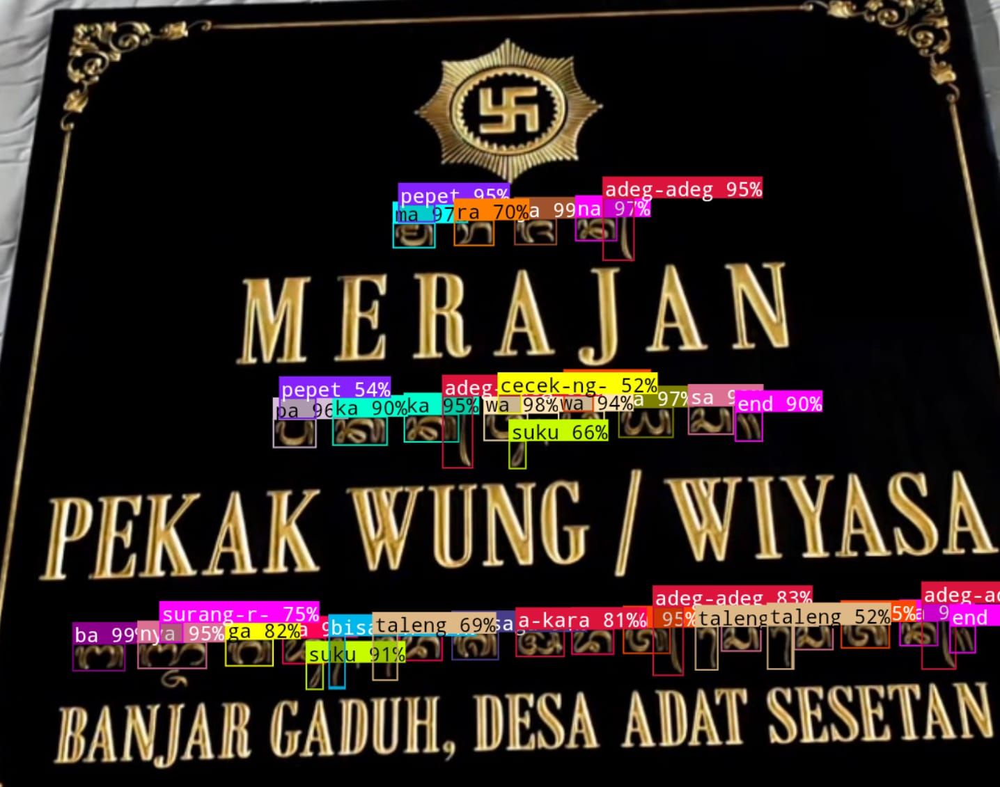
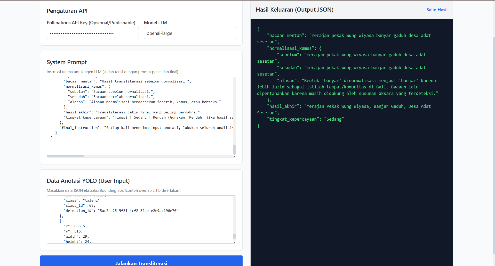

# Hasil Pengujian Gambar

Folder ini berisi hasil pemrosesan gambar mulai dari deteksi objek
hingga validasi akhir menggunakan LLM.

## Alur Pemrosesan

1. Gambar diproses menggunakan model YOLO.
2. Model menghasilkan bounding box dan data hasil deteksi.
3. Hasil deteksi dikirim sebagai konteks kepada LLM.
4. Output LLM diperiksa oleh sistem validator.
5. Validator menghasilkan keputusan akhir.

---

## 1. Hasil Deteksi Bounding Box

Gambar berikut menunjukkan objek yang berhasil dideteksi oleh model YOLO.

---

## 2. Detail Hasil Deteksi YOLO

Data lengkap hasil deteksi dapat dilihat pada file berikut:

[Klik untuk melihat DeteksiYOLO.json](DeteksiYOLO.json)

File tersebut berisi informasi seperti:

- nama kelas objek,
- confidence score,
- koordinat bounding box,
- jumlah objek yang terdeteksi.

---

## 3. Request ke LLM

Gambar berikut menunjukkan data atau prompt yang dikirimkan ke LLM.

---

## 4. Hasil Validasi

Hasil akhir dari validator dapat dilihat pada file berikut:

[Klik untuk melihat ValidatorOutput.json](ValidatorOutput.json)

Validator digunakan untuk memeriksa kesesuaian antara:

- objek hasil deteksi YOLO,
- analisis dari LLM,
- kriteria validasi sistem.
