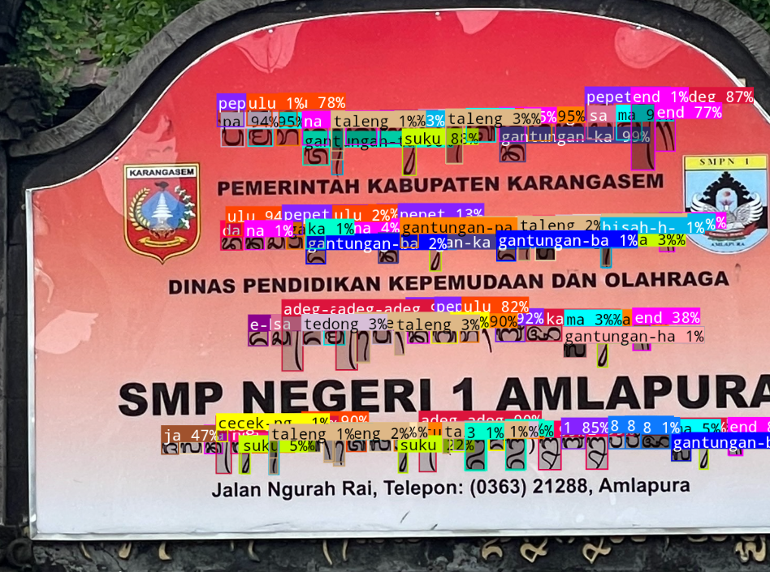
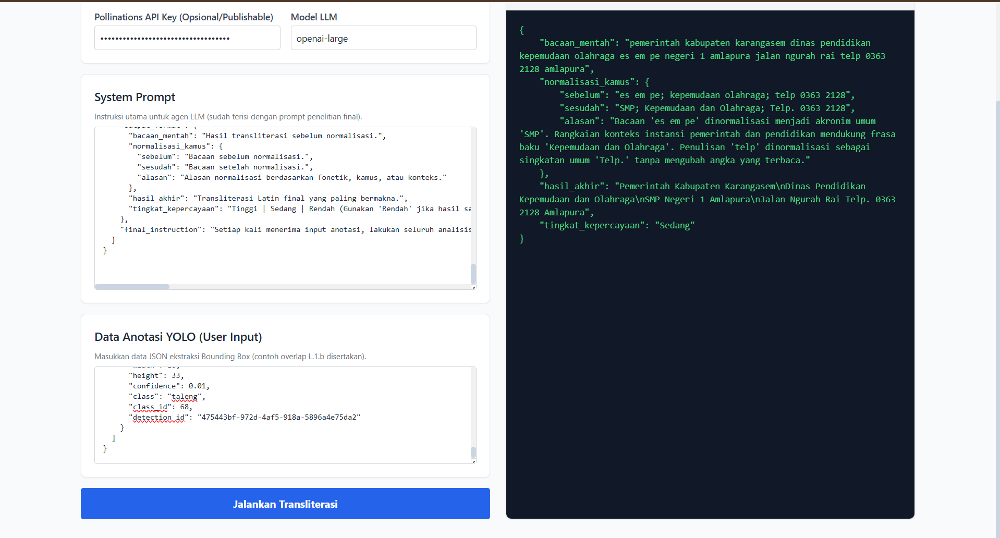

# Hasil Pengujian Gambar

Folder ini berisi hasil pemrosesan gambar mulai dari deteksi objek
hingga validasi akhir menggunakan LLM.

## Alur Pemrosesan

1. Gambar diproses menggunakan model YOLO.
2. Model menghasilkan bounding box dan data hasil deteksi.
3. Hasil deteksi dikirim sebagai konteks kepada LLM.
4. Output LLM diperiksa oleh sistem validator.
5. Validator menghasilkan keputusan akhir.

---

## 1. Hasil Deteksi Bounding Box

Gambar berikut menunjukkan objek yang berhasil dideteksi oleh model YOLO.



---

## 2. Detail Hasil Deteksi YOLO

Data lengkap hasil deteksi dapat dilihat pada file berikut:

[Klik untuk melihat DeteksiYOLO.json](DeteksiYOLO.json)

File tersebut berisi informasi seperti:

- nama kelas objek,
- confidence score,
- koordinat bounding box,
- jumlah objek yang terdeteksi.

---

## 3. Request ke LLM

Gambar berikut menunjukkan data atau prompt yang dikirimkan ke LLM.



---

## 4. Hasil Validasi

Hasil akhir dari validator dapat dilihat pada file berikut:
```json
{
    "bacaan_mentah": "pemerintah kabupaten karangasem dinas pendidikan kepemudaan olahraga es em pe negeri 1 amlapura jalan ngurah rai telp 0363 2128 amlapura",
    "normalisasi_kamus": {
        "sebelum": "es em pe; kepemudaan olahraga; telp 0363 2128",
        "sesudah": "SMP; Kepemudaan dan Olahraga; Telp. 0363 2128",
        "alasan": "Bacaan 'es em pe' dinormalisasi menjadi akronim umum 'SMP'. Rangkaian konteks instansi pemerintah dan pendidikan mendukung frasa baku 'Kepemudaan dan Olahraga'. Penulisan 'telp' dinormalisasi sebagai singkatan umum 'Telp.' tanpa mengubah angka yang terbaca."
    },
    "hasil_akhir": "Pemerintah Kabupaten Karangasem\nDinas Pendidikan Kepemudaan dan Olahraga\nSMP Negeri 1 Amlapura\nJalan Ngurah Rai Telp. 0363 2128 Amlapura",
    "tingkat_kepercayaan": "Sedang"
}
```
Teks Sebenarnya:
```
Pemerintah Kabupaten Karangasem.
Dinas Pendidikan Kepemudaan dan Olahraga
SMP Negeri 1 Amlapura.
Jalan Ngurah Rai, Telepon: (0363) 21288, Amlapura.
```
****
[Klik untuk melihat ValidatorOutput.json](ValidatorOutput.json)

Validator digunakan untuk memeriksa kesesuaian antara:

- objek hasil deteksi YOLO,
- analisis dari LLM,
- kriteria validasi sistem.
